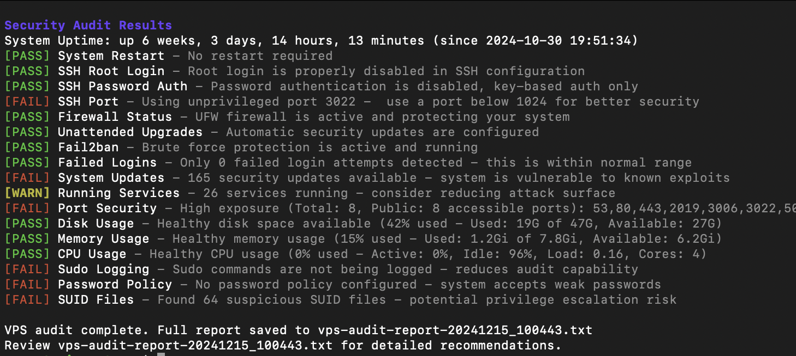

# VPS Security Audit Script

Một Bash script toàn diện để kiểm tra (audit) tính bảo mật và hiệu năng cho VPS (Virtual Private Server) của bạn. Công cụ này thực hiện nhiều kiểm tra bảo mật khác nhau và cung cấp báo cáo chi tiết kèm theo các khuyến nghị để cải thiện.

**[nuverlabs.com/vps-audit](https://nuverlabs.com/vps-audit?ref=github)** · một dự án của [Nuver Labs](https://nuverlabs.com?ref=github)

<!-- add a screenshot of the output here -->



## Tính năng (Features)

### Kiểm tra Bảo mật (Security Checks)

- **SSH Configuration**
  - Trạng thái Root login
  - Password authentication (Xác thực bằng mật khẩu)
  - Sử dụng Port không mặc định (Non-default port)
- **Firewall Status** (UFW/firewalld/iptables/nftables)
- **Intrusion Prevention** (Fail2ban/CrowdSec) Configuration
  - Đồng bộ port SSH jail của Fail2ban (phát hiện các lệnh ban đang bị vô tác dụng âm thầm)
- **Failed Login Attempts** (Số lần đăng nhập thất bại)
- **System Updates Status** (Trạng thái cập nhật hệ thống)
- Trích xuất & Phân tích **Running Services** (Các dịch vụ đang chạy)
- Phát hiện **Open Ports** (Các cổng đang mở)
- **Sudo Logging** Configuration (Cấu hình ghi log sudo)
- Thực thi **Password Policy** (Chính sách mật khẩu qua `pwquality.conf`)
- Phát hiện **SUID Files**

### Giám sát Hiệu năng (Performance Monitoring)

- Dung lượng đĩa cứng (Disk Space Usage)
- Bộ nhớ RAM (Memory Usage)
- Trạng thái CPU (CPU Usage)
- Các kết nối Internet đang hoạt động (Active Internet Connections)

---

## Yêu cầu Hệ thống (Requirements)

- Hệ điều hành Linux dựa trên Ubuntu/Debian
- Quyền **Root access** hoặc `sudo`
- Các gói cơ bản (hầu hết đã được cài sẵn):
  - `ufw`
  - `systemd`
  - `netstat`/`ss`
  - `grep`
  - `awk`

---

## Cài đặt (Installation)

1. Tải script về:

```bash
wget https://raw.githubusercontent.com/Nuver-Labs/vps-audit/main/vps-audit.sh
# hoặc
curl -O https://raw.githubusercontent.com/Nuver-Labs/vps-audit/main/vps-audit.sh
```

2. Cấp quyền thực thi cho script:

```bash
chmod +x vps-audit.sh
```

---

## Cách sử dụng (Usage)

Chạy script với quyền `sudo`:

```bash
sudo ./vps-audit.sh
```

Script sẽ thực hiện:

1. Tiến hành tất cả các kiểm tra bảo mật
2. Hiển thị kết quả theo thời gian thực (real-time) với mã màu:
   - 🟢 [PASS] - Kiểm tra đạt yêu cầu
   - 🟡 [WARN] - Phát hiện vấn đề tiềm ẩn
   - 🔴 [FAIL] - Phát hiện lỗi/nguy cơ nghiêm trọng
3. Tạo file báo cáo chi tiết: `vps-audit-report-[TIMESTAMP].txt`

## Định dạng Báo cáo Output (Output Format)

Script cung cấp hai dạng output:

1. Output thời gian thực trên console có mã màu:

```
[PASS] SSH Root Login - Root login is properly disabled in SSH configuration
[WARN] SSH Port - Using default port 22 - consider changing to a non-standard port
[FAIL] Firewall Status - UFW firewall is not active - your system is exposed
```

2. Một file báo cáo chi tiết bao gồm:
   - Tất cả kết quả kiểm tra
   - Các khuyến nghị cụ thể cho các mục bị đánh dấu FAIL
   - Thống kê mức độ sử dụng tài nguyên hệ thống
   - Nhãn thời gian (timestamp) thực hiện audit

---

## Tùy chỉnh (Customization)

Hành vi của script, đường dẫn file và ngưỡng tính điểm được điều khiển hoàn toàn bởi các biến định nghĩa trong phần **`Configuration`** ở đầu file script.

### 1. Ngưỡng động cho các trạng thái PASS/WARN/FAIL

Các biến này định nghĩa các giới hạn chỉ số kỹ thuật để kích hoạt trạng thái **WARN** hoặc **FAIL**.

| Biến | Giá trị Mặc định | Mục Kiểm tra | Mô tả |
| :--- | :--- | :--- | :--- |
| `RESOURCE_WARN` | `50` | Resource Usage | **WARN** nếu mức sử dụng Disk/Memory/CPU trong khoảng 50-80%. |
| `RESOURCE_FAIL` | `80` | Resource Usage | **FAIL** nếu mức sử dụng Disk/Memory/CPU vượt quá 80%. |
| `SERVICES_WARN` | `20` | Running Services | **WARN** nếu có từ 20-40 dịch vụ đang chạy. |
| `SERVICES_FAIL` | `40` | Running Services | **FAIL** nếu có trên 40 dịch vụ đang chạy. |
| `LOGINS_WARN` | `10` | Failed Logins | **WARN** nếu phát hiện từ 10-50 lần đăng nhập thất bại. |
| `LOGINS_FAIL` | `50` | Failed Logins | **FAIL** nếu phát hiện trên 50 lần đăng nhập thất bại. |
| `OPEN_PORTS_WARN` | `10` | Open Ports | **WARN** nếu tìm thấy từ 10-20 port đang lắng nghe (listening). |
| `OPEN_PORTS_FAIL` | `20` | Open Ports | **FAIL** nếu tìm thấy trên 20 port đang lắng nghe (listening). |
| `PASSWORD_MINLEN` | `12` | Password Policy | **PASS** nếu giá trị `minlen` trong `pwquality.conf` đạt ít nhất từ mức này. |

### 2. File Báo cáo Output và Quyền sở hữu (Ownership)

Các biến này điều khiển vị trí lưu file báo cáo và phân quyền file.

| Biến | Giá trị Mặc định | Mô tả |
| :--- | :--- | :--- |
| `DEFAULT_REPORT_DIR` | `.` *(Thư mục hiện tại)* | Thư mục nơi file báo cáo sẽ được lưu. |
| `ENABLE_CHOWN` | `false` | Nếu là `true`, sẽ gán quyền sở hữu file báo cáo (và thư mục báo cáo nếu vừa được tạo mới) cho `REPORT_CHOWN_OWNER`. |
| `REPORT_CHOWN_OWNER` | `${SUDO_USER:-$(id -un)}:<their group>` | `user:group` đích cho lệnh `chown`. Mặc định là user đã gọi `sudo`, giúp file báo cáo không bị sở hữu bởi `root`. |
| `REPORT_FILENAME` | `vps-audit-report-$(TIMESTAMP).txt` | Mẫu tên file báo cáo được tạo ra. |

### 3. Đường dẫn các File Kiểm tra Bảo mật

Bạn có thể điều chỉnh đường dẫn các file cấu hình quan trọng mà script truy cập để kiểm tra:

| Biến | Giá trị Mặc định | Mô tả |
| :--- | :--- | :--- |
| `OS_RELEASE_FILE` | `/etc/os-release` | Đường dẫn đến file phiên bản Operating System. |
| `REBOOT_REQUIRED_FILE` | `/var/run/reboot-required` | File đánh dấu hệ thống cần khởi động lại (restart). |
| `SSH_CONFIG_FILE` | `/etc/ssh/sshd_config` | File cấu hình chính của SSH daemon. |
| `AUTH_LOG_FILE` | `/var/log/auth.log` | Log file kiểm tra các lần đăng nhập thất bại. |
| `SUDOERS_FILE` | `/etc/sudoers` | File kiểm tra cấu hình ghi log của sudo. |
| `PASSWORD_QUALITY_CONF` | `/etc/security/pwquality.conf` | File cấu hình chính sách độ phức tạp mật khẩu. |
| `FAIL2BAN_CONFIG_DIR` | `/etc/fail2ban` | Thư mục cấu hình Fail2ban, dùng để xác minh port SSH jail. |

---

## Khuyên dùng (Best Practices)

1. Chạy audit thường xuyên (ví dụ: hàng tuần) để duy trì tính an toàn bảo mật
2. Đọc kỹ file báo cáo được tạo ra
3. Xử lý các trạng thái **FAIL** ngay lập tức
4. Điều tra các cảnh báo **WARN** trong các đợt bảo trì
5. Cập nhật script thường xuyên sao cho phù hợp với chính sách bảo mật của bạn

## Hạn chế (Limitations)

- Được thiết kế cho các hệ thống Linux dựa trên Debian/Ubuntu
- Yêu cầu quyền truy cập root/sudo
- Một số mục kiểm tra có thể cần tùy chỉnh cho phù hợp với môi trường đặc thù
- Không thay thế hoàn toàn cho các đợt kiểm toán bảo mật chuyên nghiệp (professional security audit)

## Đóng góp (Contributing)

Mọi đóng góp, báo lỗi (issues) và yêu cầu tính năng (enhancement requests) đều được hoan nghênh!

## Giấy phép (License)

Dự án này được cấp phép theo Giấy phép MIT - xem file LICENSE để biết thêm chi tiết.

---

## Về dự án (About)

vps-audit được phát triển và bảo trì bởi [Nuver Labs](https://nuverlabs.com?ref=github).

- Trang dự án: [nuverlabs.com/vps-audit](https://nuverlabs.com/vps-audit?ref=github)
- Tìm hiểu thêm các dự án khác: [github.com/nuver-labs](https://github.com/nuver-labs)

## Lưu ý về Bảo mật (Security Notice)

Mặc dù script này giúp phát hiện các vấn đề bảo mật phổ biến, nó không nên là biện pháp bảo mật duy nhất của bạn. Luôn luôn:

- Giữ hệ thống của bạn được cập nhật các bản vá mới nhất
- Giám sát log thường xuyên
- Tuân thủ các nguyên tắc bảo mật tối ưu (security best practices)
- Cân nhắc kiểm toán bảo mật chuyên nghiệp đối với các hệ thống quan trọng

## Hỗ trợ (Support)

Để được hỗ trợ, vui lòng:

1. Kiểm tra các issue hiện có
2. Tạo issue mới kèm thông tin chi tiết
3. Cung cấp kết quả output của script cùng thông tin hệ thống của bạn

Chúc hệ thống của bạn luôn an toàn! 🔒
